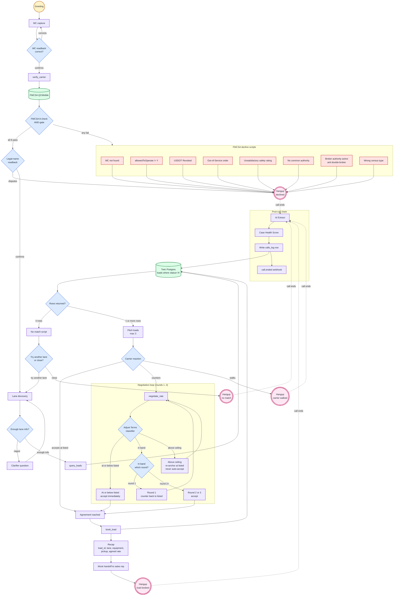

# Architecture

Acme Logistics is an inbound carrier voice agent for a freight brokerage. A carrier dials in via the HappyRobot platform; the agent verifies the carrier against FMCSA, searches active loads in a managed Postgres ("HR Twin"), negotiates within a per-call ceiling above the listed rate, books loads mid-call, and hands off to a sales rep. A separate Next.js dashboard surfaces funnel, economics, operational, and quality KPIs against the same store. The runtime is split across two Fly.io apps (FastAPI + Next.js, both in IAD) plus the HappyRobot platform itself (which hosts the voice agent, LLM nodes, post-call extraction, and the Twin Postgres). The whole stack is shaped around three trade-offs: keep agent behavior on a managed voice platform (fast iteration, no media plane to operate), keep transactional state in a single managed Postgres, and keep secrets and negotiation policy out of the LLM context (defense against prompt injection).

## Table of contents

1. [System overview](#1-system-overview)
2. [Agent decision logic](#2-agent-decision-logic)
3. [Tech stack](#3-tech-stack)
4. [Data model](#4-data-model)
5. [API contract](#5-api-contract)
6. [Caching strategy](#6-caching-strategy)
7. [Telemetry and observability](#7-telemetry-and-observability)
8. [Security model](#8-security-model)
9. [Operational vs analytical store](#9-operational-vs-analytical-store)
10. [Local development](#10-local-development)
11. [Why this stack](#11-why-this-stack)

---

## 1. System overview

A carrier opens the HappyRobot web-call URL in a browser. HappyRobot's media plane handles ASR, TTS, turn-taking, and barge-in. The Voice Agent node runs a Prompt-driven loop that calls five tools: `verify_carrier` (HTTPS webhook to FMCSA QCMobile), `query_loads` (HTTPS read against the HR Twin Postgres for active loads), `negotiate_rate` (an HR Run Python pre-processor that feeds an Adjust Terms Agreement classifier node), `book_load` (HTTPS write to HR Twin via the HR Write-to-Twin chip), and `get_current_time` (Run Python helper that returns the canonical date so the prompt never has to guess). When the call ends, an HR post-call chain runs an AI Extract node, computes a Case Health Score, writes a `calls_log` row through a Write-to-Twin chip, and POSTs a `call.ended` webhook to FastAPI. The webhook handler does post-call bookkeeping, invalidates the dashboard cache, and publishes an SSE nudge to connected dashboards.

A sales rep opens the dashboard in their browser. A signed-link middleware (HMAC-validated query token) sets a session cookie and forwards them to the App Router. Every server-rendered page in the dashboard fetches from our FastAPI using a Bearer header; FastAPI in turn reads the same `calls_log` + `bookings` + `loads` tables in HR Twin (over HappyRobot's Cloudflare WAF, which sits in front of their Twin gateway) and aggregates in Python. A 30-second TTL cache absorbs duplicate aggregation work; a 30-second Next.js ISR cache absorbs duplicate page renders.

```mermaid
flowchart TD
    Carrier((Carrier))
    SalesRep((Sales rep))
    FMCSA[FMCSA QCMobile API]

    subgraph HR["HappyRobot platform"]
        direction TB
        VoiceAgent[Voice Agent]
        GetTime[get_current_time]
        VerifyCarrier[verify_carrier]
        QueryLoads[query_loads]
        NegotiateRate[negotiate_rate]
        BookLoad[book_load]

        subgraph PostCall["Post-call chain"]
            direction TB
            Extract[AI Extract]
            CHS[Case Health Score]
            LogEvent[Log Event]
            Notify[Send Event Notification]
        end

        VoiceAgent --> GetTime
        VoiceAgent --> VerifyCarrier
        VoiceAgent --> QueryLoads
        VoiceAgent --> NegotiateRate
        VoiceAgent --> BookLoad
        VoiceAgent -.call ends.-> Extract
        Extract --> CHS --> LogEvent --> Notify
    end

    Twin[("Twin Postgres&#10;loads &middot; calls_log &middot; bookings")]

    subgraph Backend["Backend"]
        direction TB
        FastAPI[FastAPI service]
        Cache[("TTL cache 30s")]
        FastAPI <--> Cache
    end

    subgraph Frontend["Frontend"]
        Dashboard[Next.js dashboard&#10;Server Components &middot; revalidate=30]
    end

    Carrier -->|web call| VoiceAgent
    VerifyCarrier -->|carrier lookup| FMCSA
    QueryLoads -->|read active loads| Twin
    BookLoad -->|insert booking| Twin
    LogEvent -->|insert call record| Twin
    Notify -->|webhook| FastAPI

    FastAPI -->|read aggregates| Twin
    FastAPI -->|live updates| Dashboard
    Dashboard -->|fetch with bearer| FastAPI
    SalesRep -->|signed link| Dashboard
    SalesRep -.consumes bookings.-> Twin

    classDef external fill:#fef3c7,stroke:#b45309,stroke-width:2px,color:#1f2937
    classDef hrNode fill:#ede9fe,stroke:#6d28d9,stroke-width:1.5px,color:#1f2937
    classDef store fill:#dcfce7,stroke:#15803d,stroke-width:2px,color:#1f2937
    classDef backend fill:#dbeafe,stroke:#1d4ed8,stroke-width:1.5px,color:#1f2937
    classDef frontend fill:#fce7f3,stroke:#be185d,stroke-width:1.5px,color:#1f2937

    class Carrier,SalesRep,FMCSA external
    class VoiceAgent,GetTime,VerifyCarrier,QueryLoads,NegotiateRate,BookLoad,Extract,CHS,LogEvent,Notify hrNode
    class Twin,Cache store
    class FastAPI backend
    class Dashboard frontend
```



### Component boundaries

| Component | Where it runs | Owns |
|---|---|---|
| Voice Agent + Prompt | HappyRobot platform | Greeting, MC capture, tool sequencing, decline scripts, anti-jailbreak rules |
| `negotiate_rate` pipeline | HR Run Python pre-processor + Adjust Terms Agreement node | Per-round ceiling computation (agent never sees the number) + branched accept/counter classification |
| AI Extract + CHS | HappyRobot post-call chain | Per-call structured fields + 0–100 quality score |
| Write-to-Twin chip | HappyRobot | Both `book_load` mid-call write and `calls_log` post-call write |
| API service (FastAPI) | Fly.io IAD | Bearer auth, dashboard aggregations, loads catalog, SSE fan-out, `call.ended` webhook receiver |
| Dashboard service (Next.js 15) | Fly.io IAD | Server-rendered dashboard, signed-link middleware, URL filter state |
| HR Twin Postgres | HappyRobot-managed (their Cloudflare WAF in front) | Canonical store for `loads`, `calls_log`, `bookings` |
| FMCSA QCMobile | DOT-public | Carrier identity / authority / OOS lookup |

The take-home spec (`docs/FDE-TECHNICAL-CHALLENGE.md` Objective 1, 2, and 3) constrains scope: agent + dashboard + Docker, single cloud provider. There is intentionally no message broker, no warehouse, no second region, no mutual TLS — see §11 for what's deferred and the trigger for each.

---

## 2. Agent decision logic

The Voice Agent runs a single Prompt that orchestrates the tools. State is implicit (carried in the conversation transcript and the agent's own tool-call sequencing) rather than a formal state machine — this is the HR-native pattern and lets us iterate on the Prompt without redeploying any code.



### Key invariants

- **FMCSA 8-check AND-gate.** Carrier must pass all eight checks (MC found, `allowedToOperate == "Y"`, `statusCode != "R"`, no OOS date, `safetyRating != "Unsatisfactory"`, `commonAuthorityStatus == "A"`, `brokerAuthorityStatus != "A"`, `censusType == "C"`) before any load talk. Any failure routes to one of eight named decline scripts and ends the call.
- **`max_value` never reaches the agent.** The HR Run Python pre-processor computes the per-round ceiling and hands the Adjust Terms node a branch decision plus a verbatim phrase. The number stays out of LLM context, closing the prompt-injection surface for rate policy. Counters move up from listed (inbound carrier sales).
- **`book_load` is mid-call and idempotent.** `UNIQUE (call_id, load_id)` absorbs retries; a hangup after agreement still leaves a booking row. The agent recaps load_id, lane, equipment, pickup, and rate before the mocked transfer.

---

## 3. Tech stack

Python 3.12 / FastAPI / `uv` on the backend. Next.js 15 App Router (React Server Components) with Tailwind 4, shadcn/ui (Radix primitives), and Recharts on the frontend. HR Twin Postgres for transactional state. HappyRobot for the voice runtime. Fly.io single-region IAD for both services. structlog for live JSON logs.

Library choices follow the same lean rule: pydantic v2 for request validation, `cachetools.TTLCache` for the aggregation cache, `openapi-typescript` to generate dashboard types from the live OpenAPI schema at build time, `server-only` to keep the Bearer token off the client. Single-region IAD keeps both Fly apps inside ~30ms of HR Twin's US-east endpoint.

---

## 4. Data model

Three tables live in HR Twin Postgres; the Twin owns all three.

| Table | Grain | Description |
|---|---|---|
| `loads` | One row per load | Seeded catalog (~200 rows). Status column `A`/`I` flips to `I` when booked or past pickup. |
| `bookings` | One row per booking | Mid-call write from HR `book_load`. `UNIQUE (call_id, load_id)` for idempotency. |
| `calls_log` | One row per call | Post-call write from the HR Extract + CHS chain. |

DDL lives at `data/twin_schema_loads.sql`, `data/twin_schema_loads_status.sql`, `data/twin_schema_calls_log.sql`, and `data/twin_schema_bookings.sql`.

Timestamps (`pickup_datetime`, `delivery_datetime`, `created_at`, `started_at`) are stored as ISO 8601 `TEXT` so the Twin chip's substring `LIKE` filter can drive the pickup-window date-prefix match used by `query_loads`. Numerics arrive from HR as JSON strings — server code coerces on read.

---

## 5. API contract

All `/v1/*` endpoints require `Authorization: Bearer <token>` OR `x-api-key: <token>`, constant-time compared. The dashboard uses Bearer; HR webhooks default to `x-api-key`. `/healthz` and `/docs` are unauthenticated.

| Method | Path | Purpose |
|---|---|---|
| GET | `/v1/loads/{reference_number}` | Single load lookup |
| GET | `/v1/loads/search` | Filtered loads catalog |
| GET | `/v1/calls` | Calls list |
| GET | `/v1/calls/{call_id}` | Call detail (transcript opt-in) |
| GET | `/v1/calls/active` | Currently in-progress calls |
| GET | `/v1/carriers` | Per-MC rollup list |
| GET | `/v1/carriers/{mc_number}` | Per-MC profile |
| GET | `/v1/dashboard/{funnel,economics,operational,quality,calls,loads,telemetry}` | Aggregated KPI surfaces |
| POST | `/v1/events/call-ended` | Post-call webhook: bookkeeping, cache invalidate, SSE fan-out |
| POST | `/v1/events/session` | Mints a one-shot SSE session token |
| GET | `/v1/events/stream` | SSE stream for live dashboard refresh |

---

## 6. Caching strategy

Two in-process layers, both 30 seconds: Next.js ISR (`revalidate=30`) per dashboard page and `cachetools.TTLCache(ttl=30s, maxsize=128)` per FastAPI aggregation. Steady-state Twin query load drops ~95–99% on the hot path. The `call-ended` webhook calls `invalidate_dashboard_cache()` so a fresh call shows up immediately; worst case absent the webhook is ~60s staleness end-to-end.

---

## 7. Telemetry and observability

structlog JSON logs with `request_id` / `call_id` / `mc_number` bound into contextvars; a `scrub_secrets_processor` runs before the JSON renderer (§8). Per-tool latency p50/p70/p90/p99 and per-call cost estimates are computed dashboard-side from the `transcript` JSON column.

OpenTelemetry spans on the store layer and `prometheus_client` metrics are instrumented but unwired — no exporter or scrape target is configured.

---

## 8. Security model

The take-home requires HTTPS and API key auth on every endpoint. The dashboard adds a signed-link gate so the Bearer token never reaches the browser.

### The three secrets

- `HAPPYROBOT_API_KEY` — FastAPI to HR Twin.
- `API_BEARER_TOKEN` — Dashboard server to FastAPI.
- `LINK_SIGNING_SECRET` — Email recipient to dashboard (HMAC-signed URL).

Three independent keys, three independent blast radii. All three live as Fly secrets per app and in the matching local `.env` files.

### Auth flow

```
[Email recipient]
   │ signed URL: https://dash.fly.dev/?t=<exp>.<sig>   (HTTPS)
   ▼
[Dashboard middleware (Edge)]
   │ HMAC-validates token → sets `dash_auth` cookie → clean URL
   ▼
[Dashboard server-side renderer]
   │ Authorization: Bearer <API_BEARER_TOKEN>            (HTTPS)
   ▼
[FastAPI on Fly]
   │ require_api_key (constant-time HMAC compare)
   │ Authorization: Bearer <HAPPYROBOT_API_KEY>          (HTTPS)
   ▼
[HR Cloudflare WAF → HR Twin Postgres]
```

### Hardening bundle

- Header-only auth; no `?token=` fallback; both header names accepted; constant-time compare.
- `scrub_secrets_processor` redacts the HR key prefix, `Bearer <token>`, and the literal `API_BEARER_TOKEN` from every log line.
- Generic 500 handler returns `{"detail": "Internal server error", "request_id": "<uuid>"}`; original exceptions never reach the response body.
- Request middleware drops `authorization`, `x-api-key`, `cookie`, `set-cookie` values before they bind to contextvars.
- `GET /v1/calls/{call_id}` defaults `include_transcript=False`; transcript dumps require explicit opt-in.
- Negotiation ceiling is computed in HR and never enters LLM context; broker-tunable parameters live as HR workflow variables.

### Known limitations

No rate limiting on FastAPI, no FastAPI-side WAF, no mutual TLS, no rotation script (manual `fly secrets set`), no audit log beyond structlog stdout.

---

## 9. Operational vs analytical store

Twin (`loads` + `calls_log` + `bookings`) is the source of truth; FastAPI aggregates in Python over the same rows the agent writes. There is no separate warehouse, no read replica, no message broker. The escape hatch — self-hosted Postgres replica via logical replication or scheduled `pg_dump` — is unblocked by the schema but unbuilt; trigger is an HR Twin SLA gap or retention beyond 90 days. Twin REST has SQL pattern restrictions, so aggregations pull raw rows and roll up in `dashboard_aggregations.py`.

---

## 10. Local development

```powershell
# Prereqs: Python 3.12, uv, Node 18+
cp api/.env.example api/.env
cp dashboard/.env.example dashboard/.env.local
# Fill HAPPYROBOT_API_KEY and a matching API_BEARER_TOKEN in both files.

# Two terminals
cd api && uv sync && uv run uvicorn app.main:app --reload --port 8000
cd dashboard && npm install && npm run dev
```

API at `http://localhost:8000`, dashboard at `http://localhost:3000`. The Bearer token must match between `api/.env` and `dashboard/.env.local` or every dashboard request returns 401. The `call-ended` webhook is reachable from your laptop only via `curl` or a tunnel (`cloudflared` / `ngrok`). Tests: `cd api && uv run pytest -x`.

---

## 11. Why this stack

The operational store rides on HappyRobot's managed Twin Postgres so there's zero DB-ops to run at this scope. Negotiation policy lives in an HR Run Python sidecar plus the Adjust Terms node — the agent never sees the rate ceiling. Telemetry is transcript-derived rather than pulled from a separate run-details API, which keeps the dashboard working even if HR's metric surfaces drift. The dashboard skips heavier libs (Tremor, day-picker, nuqs) in favor of Recharts + native inputs to keep the bundle small.

Deferred until real traffic lands: rate limit, read replica, multi-region, webhook HMAC, OpenTelemetry exporter. The architecture doesn't need rework for any of them.
