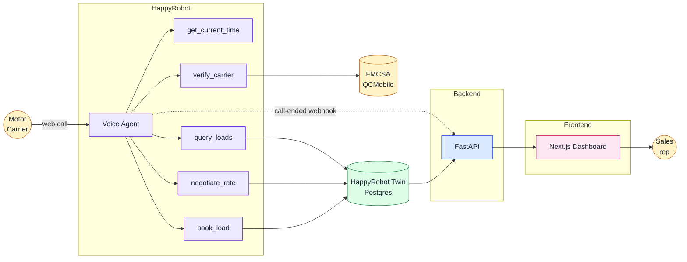

# Acme Logistics — Carrier Sales Voice Agent

> AI voice agent + ops dashboard for inbound carrier sales.


---

## What this is

Carriers dial an AI voice agent, get verified against the FMCSA in real time, hear matching loads from the broker's catalog, negotiate the rate up to three rounds, and get booked — all without a human picking up. Every call is captured (transcript, outcome, sentiment, agreed rate, MC, lane) and surfaced on a custom operations dashboard.

The voice agent itself runs on the [HappyRobot](https://happyrobot.ai) platform. This repository contains the supporting backend (FastAPI), the operations dashboard (Next.js 15), the data schemas, the prompts, and the deployment scripting that make the system reproducible end-to-end.

This was built against the HappyRobot technical challenge — full spec at [`docs/FDE-TECHNICAL-CHALLENGE.md`](docs/FDE-TECHNICAL-CHALLENGE.md). The three top-level objectives the build satisfies:

1. An inbound HR voice agent that verifies MC numbers against FMCSA, searches the loads catalog, negotiates up to three rounds, mocks a transfer to a sales rep, then extracts and classifies the call (outcome + sentiment).
2. A custom dashboard for the resulting metrics (no platform analytics).
3. Containerized with Docker, deployed to a public cloud, behind HTTPS, with API-key auth on every `/v1/*` route, and reproducible from a clean clone.

## Live demo

| What | URL |
|---|---|
| Live web call (the demo link) | https://platform.happyrobot.ai/deployments/xsfvbpjpsoy4/ma8ujkg36bkq |
| Dashboard | https://acme-dashboard-andres-morones.fly.dev |

Dashboard access requires a signed link (provided separately for evaluation). The web call link drops you straight into an inbound conversation with the agent.

## 🏗️ Architecture at a glance



Three independently deployable surfaces:

1. **HappyRobot workflow** — voice agent, prompts, the 5 tools above, post-call extraction. Lives in HR (not in this repo).
2. **API service** — FastAPI, Bearer-authed read API over the HR Twin store. Also receives the call-ended webhook for post-call bookkeeping.
3. **Dashboard service** — Next.js 15 server-rendered analytics on funnel, economics, operational, quality, and telemetry KPIs.

For a deeper walkthrough (data flow, table layout, security model, decisions), see [`ARCHITECTURE.md`](ARCHITECTURE.md).

## 🚀 Quick start (local)

You need Docker Desktop, a HappyRobot API key, and a chosen Bearer token.

```bash
git clone https://github.com/AndresMorones/AcmeLogistics.git
cd AcmeLogistics
cp .env.example .env       # then fill in API_BEARER_TOKEN + HAPPYROBOT_API_KEY
docker compose up --build
```

Then open:

- API:       http://localhost:8000  (Swagger at `/docs`)
- Dashboard: http://localhost:3000

The dashboard talks to the API over the internal Docker network — you do not need to expose anything beyond the two ports above.

### Required environment variables

| Variable | Required | Purpose |
|---|:---:|---|
| `API_BEARER_TOKEN` | yes | Shared secret between API and dashboard. Generate with `openssl rand -hex 32`. |
| `HAPPYROBOT_API_KEY` | yes | HR org API key (`sk_live_...`). API uses this server-side to read Twin. Never reaches the browser. |
| `FMCSA_WEB_KEY` | no | Reserved for a future server-side FMCSA proxy. The HR `verify_carrier` tool calls FMCSA directly today. |
| `API_BASE_URL` | no | Where the dashboard fetches from. Defaults to the in-network `http://api:8000`. |
| `LOG_LEVEL` | no | structlog filter level. Defaults to `INFO`. |

A per-service template with longer prose lives at `dashboard/.env.example`. The API reads its env via `pydantic-settings` from the same root `.env` when running under `docker compose`.

## ☁️ Deploy to your own cloud

The deployed reference targets [Fly.io](https://fly.io) in region `iad` with two apps (one for the API, one for the dashboard) and a one-time `fly secrets set` for each. Step-by-step procedure — including app create, secrets, smoke-test, and HR-side wiring — is in [`DEPLOY.md`](DEPLOY.md).

Always use the wrapper scripts under `scripts/`:

```bash
scripts/deploy-api.sh         # or .ps1 on PowerShell
scripts/deploy-dashboard.sh   # or .ps1 on PowerShell
```

They self-`cd` to the right directory and verify the deployed image's healthcheck fingerprint, so a wrong-cwd `flyctl deploy` cannot silently ship the API image to the dashboard app.

## Project structure

```
.
├── api/             FastAPI backend (Python 3.12, uv, pydantic v2, structlog)
├── dashboard/       Next.js 15 dashboard (App Router, Tailwind 4, shadcn/ui, Recharts)
├── data/            Twin DDL + loads catalog seed
├── docs/            Challenge spec + broker-facing build description
├── scripts/         Deploy wrappers + signed-link helper
├── docker-compose.yml
├── fly.toml         API Fly config (dashboard has its own under dashboard/fly.toml)
├── README.md        This file
├── DEPLOY.md        End-to-end Fly.io deployment guide
└── ARCHITECTURE.md  Stack, data model, security, decisions
```

## HappyRobot workflow

The voice agent — prompt, the 5 tools, negotiation sidecar, AI Extract, write-back to Twin — is configured inside HappyRobot and is not part of this repository (per Deliverable 5: link, not source).

The 5 tools the agent uses:

- `get_current_time` — Central Time clock sidecar (returns CT-spoken strings + UTC ISO formats) so the agent never hallucinates dates or pickup windows.
- `verify_carrier` — FMCSA QCMobile lookup with an 8-check eligibility gate.
- `query_loads` — lane / equipment search against the Twin loads catalog (active loads only).
- `negotiate_rate` — runs through a Run Python sidecar that computes the ceiling-multiplier max value, then through the HR Adjust Terms Agreement (Split-up) node, then a routed branch with the verbatim response phrase.
- `book_load` — writes the booking row to Twin.

The HR side reads from this repo's API (`/v1/loads/...`) for load lookups, and writes back to the HR Twin Postgres store after each call. The API never holds call state itself. See [`DEPLOY.md`](DEPLOY.md) for the load-lifecycle migration and [`ARCHITECTURE.md`](ARCHITECTURE.md) for the decision rationale.

## API endpoints

A subset of the routes the dashboard and HR workflow consume. All `/v1/*` routes require Bearer auth; full schemas at `/docs` (Swagger).

| Method | Path | Purpose |
|---|---|---|
| `GET` | `/healthz` | Fly healthcheck (unauthenticated) |
| `GET` | `/docs` | Swagger UI (unauthenticated) |
| `GET` | `/v1/loads/{reference_number}` | Single load lookup — used by HR `query_loads` |
| `GET` | `/v1/loads/search` | Lane / equipment search — used by HR `query_loads` |
| `GET` | `/v1/calls` | Recent calls feed (no transcript) |
| `GET` | `/v1/calls/{call_id}` | Per-call detail with bookings and lane |
| `GET` | `/v1/carriers` | Per-MC rollup feed |
| `GET` | `/v1/carriers/{mc}` | Per-MC drilldown |
| `GET` | `/v1/dashboard/funnel` | Acquisition → quote → book funnel KPIs |
| `GET` | `/v1/dashboard/economics` | Avg loadboard rate, agreed rate, effective delta |
| `GET` | `/v1/dashboard/operational` | Duration, abandon, decline rates |
| `GET` | `/v1/dashboard/quality` | Sentiment, outcome, Case Health Score distributions |

## 🔒 Security

- HTTPS everywhere via Fly.io's managed Let's Encrypt issuer (`force_https = true` in `fly.toml`).
- Every `/v1/*` route requires `Authorization: Bearer <token>` (or `x-api-key: <token>` for HR webhook nodes).
- Secrets live in Fly Secrets in production and in a gitignored `.env` locally. They are never committed.
- The API key never reaches the browser bundle — the dashboard's API client uses Next.js `server-only` imports.

The full security model — threat surface, secret rotation, what is and is not in scope — is in [`ARCHITECTURE.md`](ARCHITECTURE.md#8-security-model).

## Reproducibility

| Need | Path |
|---|---|
| Loads catalog seed | `data/twin_seed_loads_v2.sql` |
| Loads table DDL | `data/twin_schema_loads.sql` |
| Loads lifecycle migration (status, booked_at, booked_by_call_id) | `data/twin_schema_loads_status.sql` |
| `calls_log` DDL | `data/twin_schema_calls_log.sql` |
| `bookings` DDL | `data/twin_schema_bookings.sql` |
| FMCSA fixture data (offline tests) | `api/tests/fixtures/` |
| End-to-end deploy walkthrough | [`DEPLOY.md`](DEPLOY.md) |

Anyone with a Fly.io account, a HappyRobot account, and the FMCSA web key from the public QCMobile portal can stand up an equivalent deployment from a clean clone.

## Tech decisions

See [`ARCHITECTURE.md`](ARCHITECTURE.md) for design tradeoffs and the decisions behind the stack.

## Tests

```bash
cd api && uv sync && uv run pytest
```

Contract-style tests cover the auth boundary, loads endpoints, dashboard aggregations, the Twin client wrapper, dashboard caching, call/booking response shapes, FMCSA eligibility, and MC-number normalization.

## Built with

- [HappyRobot](https://happyrobot.ai) — voice platform, Twin Postgres gateway, Run Python sidecar
- [FMCSA QCMobile](https://mobile.fmcsa.dot.gov/qc) — public carrier verification API
- [Fly.io](https://fly.io) — container hosting and managed Let's Encrypt
- [Next.js 15](https://nextjs.org), [Tailwind 4](https://tailwindcss.com), [shadcn/ui](https://ui.shadcn.com), [Recharts](https://recharts.org)
- [FastAPI](https://fastapi.tiangolo.com), [Pydantic v2](https://docs.pydantic.dev), [structlog](https://www.structlog.org), [uv](https://github.com/astral-sh/uv)

MIT — see [LICENSE](LICENSE).
