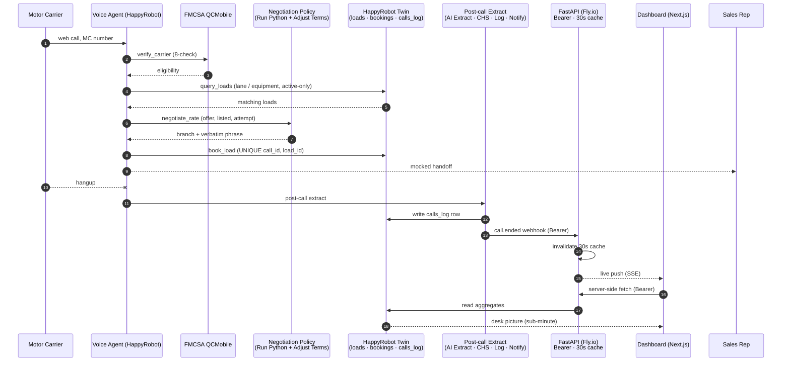

# Acme Logistics Inbound Carrier Voice Agent: Build Description

> A working proof of concept for inbound carrier sales: an AI voice agent on the HappyRobot platform that verifies carriers, searches loads, negotiates within an Acme-controlled ceiling, and books mid-call.
>
> Every call surfaces in a live operations dashboard within seconds of hangup, with full observability, traceability, outcome, and Case Health Score the desk can act on immediately.
>
> Delivered as a baseline build; Acme's institutional knowledge codifies into the agent over time through HappyRobot's built-in components and ongoing collaboration.

---

## Links

- **Live web call (demo):** `https://platform.happyrobot.ai/deployments/xsfvbpjpsoy4/ma8ujkg36bkq` (drops a caller into a conversation with the agent).
- **Live dashboard monitoring the voice agent:** `https://acme-dashboard-andres-morones.fly.dev`.
- **Code repository:** `https://github.com/AndresMorones/AcmeLogistics` (full source, architecture, and deployment guide).
- **HappyRobot workflow editor:** `https://platform.happyrobot.ai/fdeandresnavarro/workflows/xsfvbpjpsoy4/editor/qa30cjwmki9d` (workflow link created under the FDE account).

---

## Section outline

1. **System overview**
2. **Reference architecture**
3. **Operations dashboard**
4. **Forward roadmap**

---

## 1. System overview

This is the build description for the inbound carrier sales voice agent delivered to Acme Logistics on the HappyRobot platform. The agent answers inbound carrier calls, verifies the carrier against the FMCSA, searches loads, negotiates within an Acme-controlled ceiling, books mid-call, and hands off to a sales rep. The build leverages HappyRobot's built-in components (voice agent, interconnected Twin data storage, post-call extract) alongside a custom operations dashboard that reads from the same storage, so the desk sees every call within seconds of the carrier hanging up. Delivered as a working baseline that Acme extends through ongoing collaboration on the HappyRobot platform.

---

## 2. Reference architecture

The architecture follows one inbound call from dial to desk. A motor carrier opens the web-call link and lands on the **voice agent**, a prompt-driven node on the HappyRobot platform. The agent captures the MC number and invokes `verify_carrier` against the **FMCSA QCMobile public API** for the eight-check eligibility gate.

Eligible carriers are asked for lane and equipment. `query_loads` searches the active `loads` table in the **HappyRobot Twin** (HappyRobot's integrated database for workflows). Booked and past-pickup loads are filtered server-side, and matching options are read back with origin, destination, equipment, pickup window, and listed rate. When the carrier counters on rate, `negotiate_rate` routes through an isolated **negotiation policy** that computes a per-call ceiling above the listed rate and returns the agent a branch decision plus a verbatim phrase. The dollar ceiling never enters the model context, so prompt-injection cannot extract it. After three rounds without agreement, the agent walks politely. Full ceiling-multiplier rules and negotiation flow live in the GitHub architecture document.

On agreement, `book_load` writes to `bookings`. The agent recaps to the carrier and performs a mocked handoff to a sales rep with callback information attached.

Hangup triggers the post-call extract: outcome and sentiment pulled from the transcript, Case Health Score graded, the row written to `calls_log`, and a `call.ended` webhook fired to the **API service**. The desk sees the call surface within seconds.

**Integration seams.** FMCSA QCMobile (read-only public, eight-field projection); HappyRobot Twin (single shared workflow database; agent writes `bookings` + `calls_log`, dashboard reads aggregates); `call.ended` webhook (Bearer-authenticated POST from HappyRobot to the API service); Bearer token between dashboard and API service (held behind a `server-only` import barrier, never reaches the browser bundle).

**In-call tools (5).** `get_current_time` (Central Time clock plus UTC ISO so dates are not hallucinated); `verify_carrier` (FMCSA eight-check); `query_loads` (lane and equipment search, active-only filter); `negotiate_rate` (ceiling-bounded counter, dollar cap held outside the model); `book_load` (booking write with uniqueness guard against retries). These same interfaces (`negotiate_rate`, `book_load`, the post-call extract) are the seams where Acme's desk knowledge layers in over time.

Full architecture and component boundaries are documented in the GitHub repository under `ARCHITECTURE.md`.

---

## 3. Operations dashboard

The dashboard runs alongside the voice agent on the same HappyRobot Twin database the agent writes to. Every booked load, every declined call, every negotiated rate appears in the same place the desk lives, with no separate data plumbing, and a live push on call hangup keeps the picture current within seconds of the carrier ending the call.

Four operational views: a **funnel** from inbound call through FMCSA pass through pitched loads through booking; **economics** comparing listed-vs-agreed pricing across calls; **operational** signals (call duration, FMCSA decline rate, abandon rate); and **quality** signals from the post-call extract (sentiment, outcome, Case Health Score) surfaced next to the transcripts they came from.

Per-carrier drilldown closes the loop: click any MC and see every call from that carrier (verification result, every load pitched, every counter, every booking, the full transcript). The same data the voice agent acts on in real time becomes the desk's institutional memory of the relationship and the raw material for the next round of agent improvements.

---

## 4. Forward roadmap

What is operating today is the baseline build, comprising the verification gate, the negotiation isolation, the dashboard, and the five in-call tools. The next layer is the operational knowledge Acme has built over years on the desk: the lane-and-equipment patterns that flag a carrier worth keeping, the negotiation tactics rep teams have refined for difficult counters, the carrier-relationship signals that don't appear in any catalog. Encoding that institutional expertise into the prompt, the tool-routing logic, the negotiation logic, and the post-call extract step is what turns a working voice agent into Acme's voice agent.

The HappyRobot platform exposes the levers to codify that knowledge as agent behavior, then test, iterate, and recursively improve from every call transcript. HappyRobot brings the freight-industry expertise and built-in components that shorten the loop (FMCSA verification, classifier nodes, negotiation primitives, post-call extract patterns), plus expert guidance on integrating with the TMS, dispatch tooling, and monitoring services Acme already depends on.

The result is Acme's whole operation in a single source of truth, the same HappyRobot Twin the agent reads, readily available to every agent run on the platform. Source, full architecture (`ARCHITECTURE.md`), and deployment guide (`DEPLOY.md`) live in the GitHub repository linked above.
