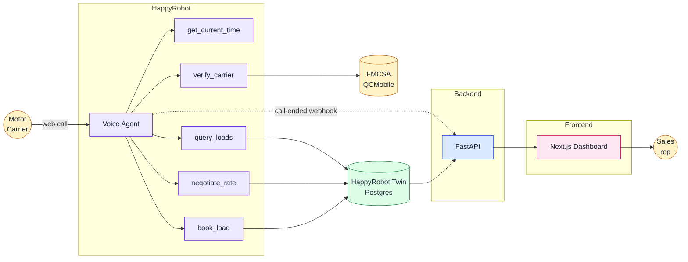
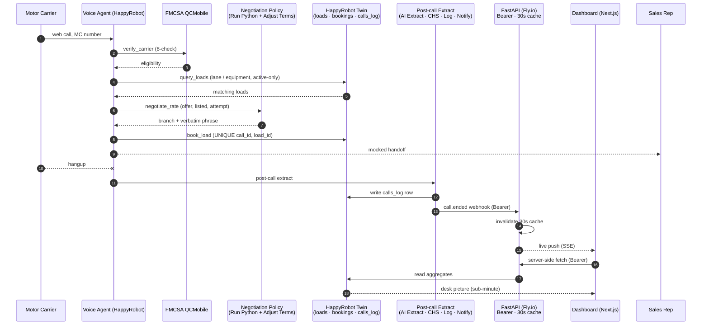

# Acme Logistics Inbound Carrier Voice Agent: Build Description

> A working proof of concept for inbound carrier sales: an AI voice agent on the HappyRobot platform that verifies carriers, searches loads, negotiates within an Acme-controlled ceiling, and books mid-call.
>
> Every call surfaces in a live operations dashboard within seconds of hangup, with full observability, traceability, outcome, and Case Health Score the desk can act on immediately.
>
> Delivered as a baseline build; Acme's institutional knowledge codifies into the agent over time through HappyRobot's built-in components and ongoing collaboration.

---

## Links

- **Live web call (demo):** `https://platform.happyrobot.ai/deployments/xsfvbpjpsoy4/ma8ujkg36bkq` (drops a caller into a conversation with the agent).
- **Live dashboard monitoring the voice agent:** `https://acme-dashboard-andres-morones.fly.dev`.
- **Code repository:** `https://github.com/AndresMorones/AcmeLogistics` (full source, architecture, and deployment guide).
- **HappyRobot workflow editor:** `https://platform.happyrobot.ai/fdeandresnavarro/workflows/xsfvbpjpsoy4/editor/qa30cjwmki9d` (workflow link created under the FDE account).

---

## Section outline

1. **System overview**
2. **Reference architecture**
3. **Operations dashboard**
4. **Forward roadmap**

---

## 1. System overview

This is the build description for the inbound carrier sales voice agent delivered to Acme Logistics on the HappyRobot platform. The agent answers inbound carrier calls, verifies the carrier against the FMCSA, searches loads, negotiates within an Acme-controlled ceiling, books mid-call, and hands off to a sales rep. The build leverages HappyRobot's built-in components (voice agent, interconnected Twin data storage, post-call extract) alongside a custom operations dashboard that reads from the same storage, so the desk sees every call within seconds of the carrier hanging up. Delivered as a working baseline that Acme extends through ongoing collaboration on the HappyRobot platform.

---

## 2. Reference architecture

The architecture follows one inbound call from dial to desk. A motor carrier opens the web-call link and lands on the **voice agent**, a prompt-driven node on the HappyRobot platform. The agent captures the MC number and invokes `verify_carrier` against the **FMCSA QCMobile public API** for the eight-check eligibility gate.

Eligible carriers are asked for lane and equipment. `query_loads` searches the active `loads` table in the **HappyRobot Twin** (booked and past-pickup rows filtered server-side). On a carrier counter, `negotiate_rate` routes through an isolated **negotiation policy**: a Run Python node computes the per-call ceiling, the Adjust Terms classifier returns a branch decision plus a verbatim phrase, and the dollar ceiling never enters the model context, so prompt-injection cannot extract it.

On agreement, `book_load` writes to `bookings` with a UNIQUE constraint guarding against retries. The agent recaps and performs a mocked dispatch handoff. Hangup triggers the post-call extract: outcome, sentiment, and Case Health Score graded from the transcript, the row written to `calls_log`, and a `call.ended` webhook fired to the API service so the dashboard sees the new call within seconds.

**In-call tools (5):** `get_current_time`, `verify_carrier`, `query_loads`, `negotiate_rate`, `book_load`. These plus the post-call extract chain are the seams where Acme's desk knowledge layers in over time. Full architecture, decision logic, and component boundaries live in [`ARCHITECTURE.md`](../ARCHITECTURE.md) on GitHub.

---

## 3. Operations dashboard

The dashboard is the desk's control tower for the voice agent. It reads from the same HappyRobot Twin the agent writes to, with a live push on every hangup so the picture refreshes within seconds. Top-line widgets surface inbound volume, booking velocity, and runtime telemetry. Charts walk the funnel from inbound through verification, pitch, negotiation, and book. Pricing visualizations track listed-versus-agreed rates per call so margin compression surfaces immediately.

Calls that need a human read are flagged automatically. Low Case Health Scores, negative sentiment, FMCSA declines, and tool-call failures bubble up so reviewers can intervene where it matters instead of scrolling through every transcript. Click any flagged row and the full trail opens: every tool call the agent made, every counter the carrier put on the table, the FMCSA verdict, and the audit remarks from the post-call extract. Auditing the agent's behavior is one click, not an afternoon.

Per-carrier observability closes the loop. Every MC has a relationship history that pulls every call from that carrier into one view, from verification through booking. Sales reps work the booked-load queue from a kanban with Approve and Reject controls, acting on the same Twin surface the agent wrote to so a booking never falls through the cracks. The same data the agent runs on in real time becomes Acme's institutional memory of every relationship and the raw material for the next round of agent improvements.

---

## 4. Forward roadmap

Today's build is the baseline: verification, negotiation isolation, live operations dashboard, five in-call tools. The next layer encodes Acme's process and internal workflow into the prompt, the tool routing, and the post-call extract: your insights and your knowledge become the agent's. That's what turns a vendor's voice agent into Acme's, with HappyRobot's freight expertise compressing every cycle.
