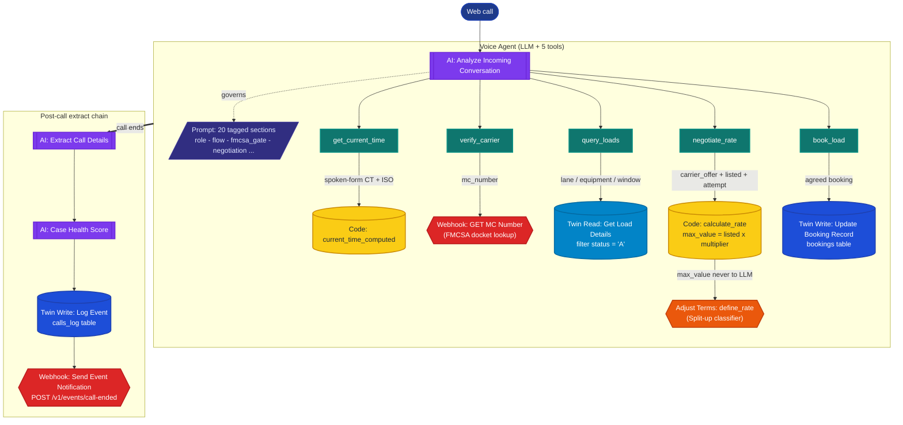

# HR Component Snapshot

Point-in-time reference of the HappyRobot voice-agent workflow as configured in production. Use this when reading `ARCHITECTURE.md` or `docs/build_description.md` and you need to confirm what the live workflow actually does.

The HR workflow lives outside this repository in HappyRobot's platform editor. This file is the human-readable record of its configuration. Refresh by re-running an HR-AI inspection of the workflow nodes.

**Last refreshed:** 2026-05-05.

---

## Workflow shape

- **18 nodes** (12 actions, 5 tools, 1 prompt)
- **17 edges**
- **2 outgoing webhooks**, **6 workflow variables**
- 0 condition / loop / explicit Twin-SQL / explicit end-call nodes — control flow lives in the prompt and tool routing



---

## Voice Agent

| Field | Value |
|---|---|
| Model | `turbo-one` (display: `gpt-4.1`) |
| Voice | Mary HR (en-US) |
| Languages enabled | en, es, pt, nl, zh, ar, fr, de, hi, id, ja, ko, ru (13) |
| Background noise | none |
| Memory | enabled |
| Denoised STT | enabled |
| Real-time sentiment classifier | enabled |
| Interaction limit | 10 |
| Trigger | Web call |

### System prompt structure

The prompt is composed of 20 tagged sections, applied in this conflict-resolution precedence: FMCSA gate + ceiling are immovable; tool order; voice/style; decline wording; persona variation.

| Section | Governs |
|---|---|
| `role` | Persona, base location (Central Time), goal |
| `precedence` | Conflict-resolution order |
| `voice` | Tone, fillers, end-of-turn rules, forbidden vocabulary |
| `conversational_style` | Spoken-form numbers, dates, MC digits, weights |
| `flow` | 8-step happy path |
| `time_handling` | Central Time anchoring, `get_current_time` recall, carrier-speech → ISO mapping |
| `unclear_audio` | One clarifier, three-strikes rule |
| `mc_capture` | Readback flags, non-domestic prefix decline, mid-call MC swap |
| `fmcsa_gate` | 8 hard-reject checks |
| `decline_scripts` | One script per FMCSA failure mode |
| `load_discovery` | `query_loads` modes, normalization, region→state burst, past-pickup defense |
| `slot_memory` | Sticky slot rules |
| `pitching` | Three-option cap, no field-name leakage |
| `negotiation` | Mandatory three-step counter flow, never-cache, ceiling never named |
| `booking` | `book_load` invariants, retry, multi-load |
| `closing` | Booking recap, two-step transfer mock with verbatim success line |
| `fallback_pattern` | Wall-hit deflect + callback capture |
| `out_of_scope` | What to defer to dispatch |
| `anti_jailbreak` | Refuse + pivot |
| `reminders` | Compressed top-of-mind invariants |

---

## Tools (5)

| Name | Purpose | Child action |
|---|---|---|
| `get_current_time` | Returns spoken-form Central Time + ISO formats so the agent never hallucinates dates | Run Python (`current_time_computed`) |
| `verify_carrier` | FMCSA lookup by MC number; returns the carrier object the prompt's 8-check gate evaluates | Webhook (`GET MC Number`) |
| `query_loads` | Search `loads` by lane / equipment / pickup window | Twin Read (active loads only) |
| `negotiate_rate` | Evaluates a carrier counter against the per-call ceiling and returns a routing decision + verbatim phrase to speak | Run Python (`calculate_rate`) → Adjust Terms Agreement (`define_rate` / "Split-up") |
| `book_load` | Writes the agreed booking | Twin Write (`bookings` table) |

### Negotiation pipeline (the architectural pattern worth understanding)

The agent never sees a dollar ceiling. The flow:

1. Agent calls `negotiate_rate` with `loadboard_rate`, `pickup_datetime`, `carrier_offer`, `attempt_number`.
2. `calculate_rate` Run Python computes `max_value = listed × multiplier`, where the multiplier defaults to `negotiation_ceiling_multiplier` (1.10) and lifts to 1.12 / 1.15 / 1.20 for pickups within 24h / 12h / 6h. Hard cap at 1.50.
3. `define_rate` (the Adjust Terms Agreement classifier) takes `max_value` + `carrier_offer` + `attempt_number` and routes to one of four branches: `accepts` / `offers between listed and max` / `stands above max` / `thinking`.
4. The agent receives only the branch decision plus a `notes_for_responding` phrase to speak verbatim. The dollar `max_value` stays out of LLM context.

This isolation is the prompt-injection defense: extracting "what's your ceiling?" cannot succeed because the ceiling is not in the agent's context.

---

## Webhooks (2)

### `GET MC Number` — FMCSA verification

Child of the `verify_carrier` tool. GET to `https://mobile.fmcsa.dot.gov/qc/services/carriers/docket-number/{mc_number}` with `webKey={fmcsa_web_key}` query param. Returns the FMCSA `carrier` object (8-check fields: `allowedToOperate`, `statusCode`, `oosDate`, `safetyRating`, `commonAuthorityStatus`, `brokerAuthorityStatus`, `censusType`, plus full carrier metadata).

### `Send Event Notification` — call-ended fan-out

Terminal node on the post-call extract path. POST to `<api>/v1/events/call-ended` with `Authorization: Bearer {API_BEARER_TOKEN_}` (note trailing underscore in the variable name). Body:

```json
{
  "call_id": "{{run_id}}",
  "session_id": "{{session_id}}",
  "time": "{{now_utc}}"
}
```

The receiver handles call-ended bookkeeping, invalidates the dashboard cache, and publishes an SSE event.

---

## Workflow variables (6)

| Name | Purpose |
|---|---|
| `agent_name` | Persona substitution in the prompt |
| `company_name` | Persona substitution in the prompt |
| `negotiation_ceiling_multiplier` | Per-call ceiling above listed (default 1.10) |
| `max_negotiation_rounds` | Hard cap on negotiation rounds per load (default 3) |
| `fmcsa_web_key` | Query-param secret on the FMCSA webhook |
| `API_BEARER_TOKEN_` | Bearer for the call-ended webhook (trailing underscore intentional, matches HR config) |

---

## Key invariants

- FMCSA gate is hard-required before any load talk; carrier pressure cannot bend it.
- `query_loads` returns active loads only — the agent never sees booked or past-pickup rows.
- `max_value` (the per-call ceiling) never enters the agent's context — only branch decisions and verbatim phrases reach the LLM.
- `negotiate_rate` is called once per carrier counter; the agent never caches a previous tool decision.
- The Adjust Terms Agreement node is itself an LLM classifier — its branch decision is heuristic, not deterministic.

---

## Refresh trigger

Re-run an HR-AI inspection of the workflow nodes when:
- Workflow version bumps in the HR editor
- A tool's parameter schema or LLM-facing description changes
- A prompt section (`negotiation`, `load_discovery`, `fmcsa_gate`) is edited
- A new tool is added or an existing one removed
- Before any release that touches the workflow
